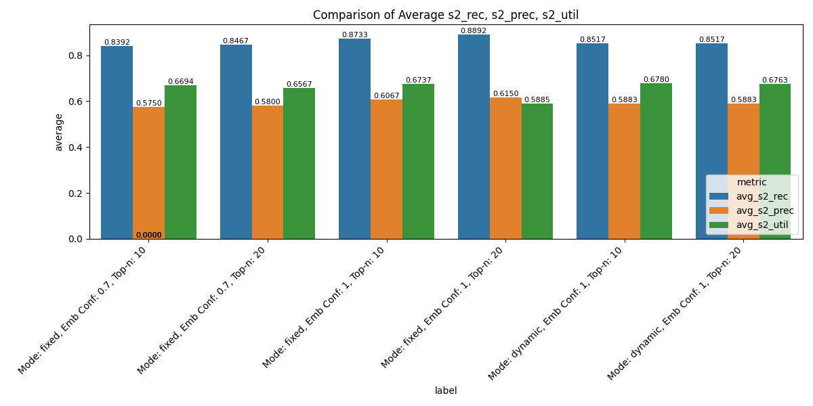

# RAG Candidate Pool Size Calibrator
## Overview
This project implements a retrieval pipeline evaluation framework for comparing different reranking strategies in Retrieval-Augmented Generation (RAG). It integrates FAISS dense retrieval, cross-encoder reranking, and dynamic candidate pool sizing to study trade-offs between recall, precision, and latency-aware utility.
The framework is designed to:
* Build a global corpus from the HotpotQA dataset.
* Encode queries and contexts using SentenceTransformers.
* Evaluate retrieval performance across multiple reranking strategies:
	* Fixed top‑N reranking
	* Dynamic reranking (confidence‑aware sigmoid scaling)
* Log results to CSV files and visualize comparisons.

## Components
* constants.py
Centralizes paths, dataset size, and model definitions (SentenceTransformer + CrossEncoder).
* dataset_loader.py
Loads HotpotQA, chunks passages into overlapping sentences, maps queries to gold contexts, and saves:
	* global_corpus.pkl (corpus chunks)
	* dataset.csv (query dataset with references)
* helper.py
Utility functions for:
	* Text chunking
	* FAISS index building
	* Retrieval evaluation (precision, recall via RAGAS)
	* Latency‑aware utility scoring
	* Dynamic rerank pool sizing (calculate_sigmoid_k with median confidence midpoint)
* evaluation_loop.py
Core pipeline:
	* Dense retrieval with FAISS
	* Confidence scoring
	* Optional reranking (fixed or dynamic)
	* Metric logging (precision, recall, utility, latency)
* comparison.py
Aggregates results from multiple CSVs, computes averages, and visualizes comparisons with bar charts.
* main.py
CLI entry point using Python Fire. Exposes:
	* get_dataset → build corpus and dataset
	* main_pipeline → run evaluation
	* result_comparison → visualize results

## Usage
### 1. Build Dataset and Corpus
`python main.py get_dataset`
### 2. Run evaluation pipeline
`python main.py main_pipeline --mode=dynamic --emb_conf_threshold=1 --top_n=20`

Results are saved to src/results_{mode}_{emb_conf_threshold}_{top_n}.csv.
### 3. Compare results
`python main.py result_comparison`
## Results Snapshot

### Key Insights
* Fixed top‑N (20) achieves the highest recall (~0.8892) but lower utility due to latency.
* Dynamic reranking balances recall and utility, performing close to fixed top‑N with reduced computational cost, maximizing rate of investment.
* Precision is consistently higher in fixed mode, but dynamic mode remains competitive.
## Requirements
* Python 3.9+
* Libraries: pandas, numpy, faiss, sentence-transformers, ragas, datasets, matplotlib, seaborn, fire
## Conclusion
This framework provides a reproducible way to benchmark retrieval strategies in RAG pipelines. By combining dense retrieval, reranking, and confidence‑aware dynamic sizing, it helps identify the sweet spot between accuracy and efficiency.
